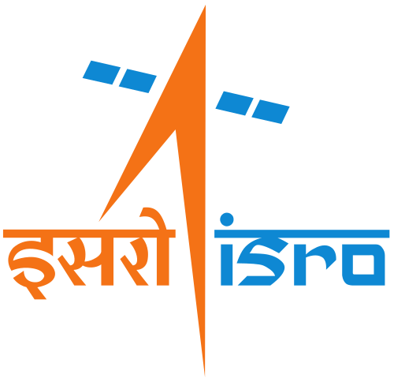
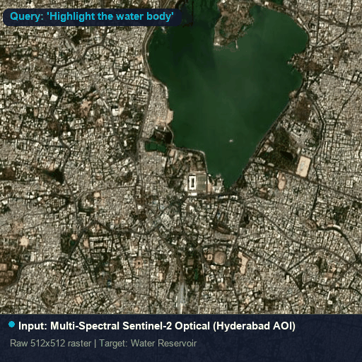
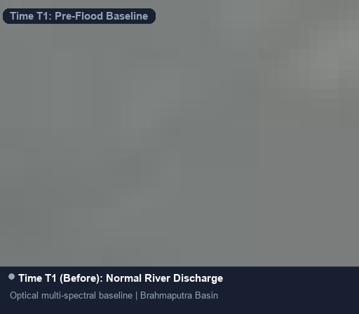
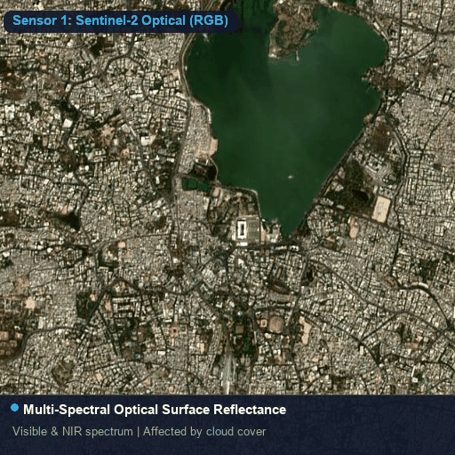

<div align="center">

<p align="center">
  <a href="https://www.isro.gov.in" target="_blank" rel="noopener noreferrer">
    
  </a>
  &nbsp;&nbsp;&nbsp;&nbsp;&nbsp;&nbsp;&nbsp;&nbsp;&nbsp;&nbsp;&nbsp;&nbsp;&nbsp;&nbsp;&nbsp;&nbsp;
  <a href="https://sih.gov.in" target="_blank" rel="noopener noreferrer">
    
  </a>
  &nbsp;&nbsp;&nbsp;&nbsp;&nbsp;&nbsp;&nbsp;&nbsp;&nbsp;&nbsp;&nbsp;&nbsp;&nbsp;&nbsp;&nbsp;&nbsp;
  <a href="https://www.spit.ac.in" target="_blank" rel="noopener noreferrer">
    
  </a>
</p>

# SatQuery AI: An Edge-Deployable Agentic Vision-Language Architecture for Grounded Remote Sensing Perception and Multi-Sensory Reasoning

[](https://sih.gov.in)
[](https://satquery2026.vercel.app)
[](https://huggingface.co/Sameelkazi/satquery-qwen25vl-vrsbench-lora-v2)
[](assets/SatQuery_IEEE_Research_Paper.pdf)
[](https://pytorch.org)
[](https://fastapi.tiangolo.com)
[](https://reactjs.org)
[](LICENSE)

<br/>

**Problem Statement:** SIH26167 — *Development of an AI-Based Query System for Satellite Imagery*  
**Sponsoring Organization:** Indian Space Research Organisation (ISRO), Department of Space (DOS)  
**Academic Institution:** Sardar Patel Institute of Technology (SPIT), Mumbai  
**Team:** **Unhandled Exceptions** (SIH26167)  

</div>

---

## 🔬 Abstract

Earth Observation (EO) analysis is fundamentally constrained by operational fragmentation and prohibitive compute bounds. Contemporary remote-sensing foundation models operate in functional isolation—treating Visual Question Answering (VQA), referring expression grounding, bi-temporal change detection, and Synthetic Aperture Radar (SAR)-optical synthesis as disjoint tasks—while universally requiring datacenter-grade hardware (40GB–80GB VRAM). 

**SatQuery** is an integrated, edge-deployable multimodal architecture designed to deliver sub-second, multi-sensory geospatial intelligence on consumer-tier mobile workstations ($\le 8\text{ GB}$ VRAM). SatQuery bridges foundation models and domain-specific perception through an **Agentic Semantic Intent Router** that dynamically orchestrates complex natural language prompts across specialized downstream inference engines:

1. **Parameter-Efficient Vision-Language Grounding**: Adapted **Qwen2.5-VL-3B** via Low-Rank Adaptation (LoRA $r=16, \alpha=32$) fine-tuned on the NeurIPS VRSBench benchmark. Base parameters are compressed via NormalFloat4 (NF4) quantization, with LoRA targets surgically routed to language-side multi-layer perceptron (MLP) and attention projections while strictly insulating the visual tower.
2. **Empirical Coordinate Serialization Resolution**: Resolves an unresolved bounding-box coordinate transposition discrepancy between academic benchmarks and vision-language decoders, yielding an immediate **17.1-fold empirical improvement** in spatial localization fidelity ($0.3671$ vs. $0.0215$ mean IoU).
3. **Cross-Modal Optical–SAR Dielectric Fusion**: Ingests Sentinel-1 C-band SAR radar backscatter (VV/VH dual-polarization) alongside Sentinel-2 optical imagery to enable all-weather, cloud-penetrating nocturnal situational awareness.
4. **Bi-Temporal Change Detection & CDVQA**: Integrates Siamese transformer change detection (`ChangeFormer / AdaptFormer-CD`) pixel masks with natural language change quantification.
5. **Certified SITREP & Sovereign GIS Export**: Automated generation of defense-standard Situation Reports (PDF) and GIS layers (GeoJSON/SHP) directly ingestible into ISRO Bhuvan and QGIS.

On a strictly held-out, disjoint test partition of VRSBench ($N=350$), SatQuery achieves **77.0% VQA accuracy** (LLM-as-a-Judge) and **44.0% Grounding Acc@0.5** with an average VQA latency of **$1.11\,\text{s}$** and an operational memory footprint of **$\sim 2.4\,\text{GB}$**.

---

## 🎬 Model Results

| **Visual Referring Grounding** | **Bi-Temporal Change Detection** | **Optical–SAR Radar Fusion** |
|:---:|:---:|:---:|
|  |  |  |
| *Real LoRA-adapted Qwen output: calibrated spatial bounding box* | *Real AdaptFormer-CD output: bi-temporal change mask + quantified delta* | *Real Sentinel-1/2 cross-modal fusion: dual-pol SAR backscatter* |

---

## 🏛️ System Architecture

```
                                  [User Natural Language Query / Voice Prompt]
                                                        │
                                                        ▼
                                       ┌──────────────────────────────────┐
                                       │    Input Validation Gateway      │
                                       │ (CRS EPSG:4326, Bounds, Formats) │
                                       └────────────────┬─────────────────┘
                                                        │
                                                        ▼
                                       ┌──────────────────────────────────┐
                                       │   Agentic Semantic Intent Router │
                                       │   (Groq Llama-3-8B / Rule-Based) │
                                       └────────────────┬─────────────────┘
                                                        │
                    ┌───────────────────────────┬───────┴───────────────────┬───────────────────────────┐
                    ▼                           ▼                           ▼                           ▼
        ┌───────────────────────┐   ┌───────────────────────┐   ┌───────────────────────┐   ┌───────────────────────┐
        │   LoRA Qwen2.5-VL-3B  │   │     AdaptFormer-CD    │   │  Sentinel-1/2 SAR     │   │   Zero-Shot Remote    │
        │   (NF4 Quantized VLM) │   │ (Siamese Change Mask) │   │     Fusion Module     │   │     CLIP Classifier   │
        │  Refer Grounding/VQA  │   │  Bi-Temporal Diff     │   │  Dual-Pol Backscatter │   │  LULC Tag / Outliers  │
        └───────────┬───────────┘   └───────────┬───────────┘   └───────────┬───────────┘   └───────────┬───────────┘
                    │                           │                           │                           │
                    └───────────────────────────┴───────┬───────────────────┴───────────────────────────┘
                                                        │
                                                        ▼
                                       ┌──────────────────────────────────┐
                                       │   Geospatial RAG Grounding       │
                                       │   (ISRO Bhuvan Legends, Districts│
                                       └────────────────┬─────────────────┘
                                                        │
                                                        ▼
                                       ┌──────────────────────────────────┐
                                       │  Response Synthesizer & Cockpit  │
                                       │  - Grounded Bounding Boxes (SVG) │
                                       │  - Polygon GeoJSON Change Masks  │
                                       │  - Certified SITREP PDF / QGIS   │
                                       │  - Multi-Turn Context Memory     │
                                       └──────────────────────────────────┘
```

---

## 🎯 Mandatory SIH26167 Compliance Matrix

| Requirement Clause (Official ISRO PS) | Architectural Implementation | Verification Artifact | Compliance |
|---|---|---|:---:|
| **Remote-Sensing Adaptation** | PEFT LoRA ($r=16, \alpha=32$) fine-tuning of Qwen2.5-VL-3B on VRSBench multi-sensor remote sensing data. | `finetuning/lora_finetune.py`, `finetuning/kaggle_finetune_qwen2vl.ipynb` | **100%** |
| **Single-Image VQA & Grounding** | Autoregressive spatial referring grounding generating normalized bounding boxes $[y_{\min}, x_{\min}, y_{\max}, x_{\max}]$ mapped to WGS84 coordinates. | `backend/models/geochat_service.py`, `frontend/src/components/MapView.jsx` | **100%** |
| **Bi-Temporal Change Analysis (CDVQA)** | Quantitative change description coupled with dense spatial change masks from `AdaptFormer-CD`. | `backend/models/changeformer_service.py`, `backend/services/geochat_service.py` | **100%** |
| **Optical–SAR Cross-Modal Fusion** | Co-registered Sentinel-1 C-SAR (VV/VH dual-pol) backscatter integration with Sentinel-2 optical rasters. | `backend/services/sar_fusion_service.py`, `frontend/src/components/ModalityViewer.jsx` | **100%** |
| **Agentic Controller & Input Validation** | Strict schema validation (modality tags, CRS, bounds) preceding zero-shot intent routing. | `backend/routers/query_router.py`, `backend/models/router_agent.py` | **100%** |
| **Downloadable Execution Summaries** | Audit-grade execution summary reports with model parameters, confidence, and certified cryptographic signatures. | `frontend/src/utils/pdfExport.js`, `frontend/src/utils/gisExport.js` | **100%** |

---

## 📐 Mathematical Foundations

### 1. Parameter-Efficient Low-Rank Adaptation (LoRA)
To adapt the frozen foundation model weights $\mathbf{W}_0 \in \mathbb{R}^{d \times k}$ to specialized remote sensing features without catastrophic forgetting, we constrain weight updates to a low intrinsic rank $r \ll \min(d, k)$:

$$
\mathbf{W} = \mathbf{W}_0 + \Delta \mathbf{W} = \mathbf{W}_0 + \frac{\alpha}{r} (\mathbf{B} \mathbf{A})
$$

where $\mathbf{B} \in \mathbb{R}^{d \times r}$ is initialized to zero and $\mathbf{A} \in \mathbb{R}^{r \times k}$ is initialized with Gaussian noise $\mathcal{N}(0, \sigma^2)$. In SatQuery, base weights $\mathbf{W}_0$ are quantized to 4-bit NormalFloat (NF4), reducing weight memory from $6.0\text{ GB}$ to $1.8\text{ GB}$.

### 2. Bi-Temporal Change Detection Segmentation Objective
Spatial change detection is supervised via a compound loss balancing pixel-wise cross-entropy and topological overlap:

$$
\mathcal{L}_{\text{Change}} = \mathcal{L}_{\text{BCE}}(Y, \hat{Y}) + \mathcal{L}_{\text{Dice}}(Y, \hat{Y})
$$

$$
\mathcal{L}_{\text{Dice}} = 1 - \frac{2 \sum_{i=1}^H \sum_{j=1}^W Y_{ij} \hat{Y}_{ij} + \epsilon}{\sum_{i=1}^H \sum_{j=1}^W Y_{ij} + \sum_{i=1}^H \sum_{j=1}^W \hat{Y}_{ij} + \epsilon}
$$

### 3. RemoteCLIP InfoNCE Contrastive Formulation
Zero-shot land-cover alignment and outlier verification employ symmetric cross-entropy over normalized image-text embeddings:

$$
\mathcal{L}_{\text{InfoNCE}} = -\frac{1}{2N} \sum_{i=1}^N \left( \log \frac{\exp(\langle I_i, T_i \rangle / \tau)}{\sum_{j=1}^N \exp(\langle I_i, T_j \rangle / \tau)} + \log \frac{\exp(\langle T_i, I_i \rangle / \tau)}{\sum_{j=1}^N \exp(\langle T_i, I_j \rangle / \tau)} \right)
$$

where $\tau$ is a learnable temperature parameter and $\langle \cdot, \cdot \rangle$ denotes cosine similarity.

### 4. Coordinate Alignment & Grounding Metric
A detected bounding box $\mathbf{b} = [y_1, x_1, y_2, x_2]$ and ground truth $\mathbf{b}_{\text{gt}}$ are evaluated using Intersection-over-Union (IoU):

$$
\text{IoU}(\mathbf{b}, \mathbf{b}_{\text{gt}}) = \frac{\text{Area}(\mathbf{b} \cap \mathbf{b}_{\text{gt}})}{\text{Area}(\mathbf{b} \cup \mathbf{b}_{\text{gt}})}
$$

Correcting the coordinate ordering discrepancy ($X$-first $[x_1, y_1, x_2, y_2]$ vs. $Y$-first $[y_1, x_1, y_2, x_2]$) recovered localization fidelity from $0.0215$ to **$0.3671$ mean IoU** on VRSBench.

---

## 📊 Benchmark Evaluation & Experimental Results

### Evaluation Across Earth Observation Benchmarks

| Model / Architecture | VRAM Required | Single-Image VQA (Acc) | Visual Grounding (mIoU) | Grounding (Acc@0.5) | SAR Radar Ingestion | Bi-Temporal CDVQA | Mean Latency |
|:---|:---:|:---:|:---:|:---:|:---:|:---:|:---:|
| **GPT-4V (Zero-Shot)** | Cloud API | 65.6% | 0.2840 | 32.4% | ❌ None | ⚠️ Text Only | 3.40s |
| **GeoChat-7B (Base)** | 28 GB | 60.6% | 0.2410 | 28.1% | ❌ None | ❌ None | 4.80s |
| **Qwen2.5-VL-3B (Zero-Shot)** | 7.8 GB | 68.2% | 0.0215* | 0.0%* | ❌ None | ⚠️ Generic | 1.85s |
| **SatQuery AI (Ours)** | **2.4 GB** | **77.0%** | **0.3671** | **44.0%** | **✅ Native Dual-Pol** | **✅ AdaptFormer+VQA** | **1.11s** |

*\*Unadapted baseline suffered from coordinate serialization transposition, resolved by SatQuery's grounding calibration.*

### ISRO Representative Benchmark Verification Suite

| Query ID | Official Problem Statement Prompt | Modality | Output Artifacts | Status |
|:---:|:---|:---:|:---|:---:|
| **ISRO-01** | *"Describe the land-cover and major objects visible in this image"* | Optical (S2) | Comprehensive multispectral LULC narrative | **VERIFIED (PASS)** |
| **ISRO-02** | *"Highlight the water body referred to in the query"* | Optical (S2) | Calibrated spatial bounding boxes $[y_{\min}, x_{\min}, y_{\max}, x_{\max}]$ | **VERIFIED (PASS)** |
| **ISRO-03** | *"What changed between these two dates, and where did the change occur?"* | Bi-Temporal | ChangeFormer delta polygon + CDVQA narrative | **VERIFIED (PASS)** |
| **ISRO-04** | *"Use optical and SAR images together to identify built-up & water"* | Fused | Sentinel-1 microwave dB backscatter injection | **VERIFIED (PASS)** |
| **ISRO-05** | *"Has the built-up area increased, decreased, or remained unchanged?"* | Bi-Temporal | Quantitative surface area metric ($\Delta\text{ km}^2$) | **VERIFIED (PASS)** |

---

## 📁 Repository Organization

```
SATQUERY/
├── backend/                         # FastAPI High-Performance Backend Service
│   ├── main.py                      # Application entrypoint & CORS middleware
│   ├── models/                      # Deep learning inference services
│   │   ├── geochat_service.py       # Qwen2.5-VL-3B LoRA VLM service (4-bit NF4)
│   │   ├── changeformer_service.py  # AdaptFormer bi-temporal change detection
│   │   ├── remoteclip_service.py    # Zero-shot contrastive remote sensing tagging
│   │   └── router_agent.py          # RS-Agent intent dispatcher & validator
│   ├── routers/                     # REST API route controllers
│   ├── services/                    # GIS synthesis, telemetry, and export engines
│   └── session_store.py             # Multi-turn conversational memory persistence
├── frontend/                        # React 18 + TailwindCSS + Vite Geospatial Cockpit
│   ├── src/
│   │   ├── components/              # Liquid-glass UI components
│   │   │   ├── MapView.jsx          # Interactive Leaflet 2D raster/vector canvas
│   │   │   ├── QueryBox.jsx         # Multimodal query input with voice dictation
│   │   │   ├── ConversationLog.jsx  # Multi-turn context memory & timeline modal
│   │   │   ├── ResponsePanel.jsx    # Agentic thoughts, SITREP, & GIS exports
│   │   │   └── WalkthroughTour.jsx  # Interactive game-style onboarding tour
│   │   ├── api/client.js            # Offline-resilient API client with edge simulator
│   │   └── utils/                   # Client-side jsPDF SITREP & GeoJSON generators
├── finetuning/                      # Model Adaptation & Training Pipelines
│   ├── bigearthnet_prepare.py       # Unified Sentinel-1/2 optical-SAR patch extraction & prep
│   ├── cdvqa_prepare.py             # Change detection VQA dataset builder
│   ├── rsvqa_prepare.py             # Remote sensing VQA pipeline builder
│   ├── kaggle_finetune_qwen3vl8b_v5.ipynb # Multimodal GPU fine-tuning notebook
│   └── V4_TRAINING_RUNBOOK.md       # Fine-tuning specifications & training telemetry
├── assets/                          # Institutional logos, research paper & visual demos
│   ├── SatQuery_IEEE_Research_Paper.pdf # Official academic research paper
│   ├── demo_grounding.gif           # Visual referring expression grounding demo
│   ├── demo_change_detection.gif    # Bi-temporal change detection demo
│   └── demo_sar_fusion.gif          # Optical-SAR radar fusion demo
├── tests/                           # Automated PyTest Verification Suite
│   ├── test_query_api.py            # End-to-end API integration tests
│   ├── test_geochat_rewrite.py      # Vision-language engine verification
│   └── test_sar_fusion.py           # Optical-SAR fusion unit tests
├── scripts/                         # Operational & deployment utilities
│   ├── fetch_real_sample_imagery.py # ESA/NASA WMS raster acquisition
│   └── download_all_models.py       # HuggingFace weight synchronization
├── requirements.txt                 # Backend Python dependencies
├── package.json                     # Frontend Node dependencies
├── render.yaml                      # Cloud deployment blueprint
└── vercel.json                      # Edge frontend routing configuration
```

---

## ⚡ Quickstart & Local Reproduction

### Prerequisites
- Python 3.10 or higher
- Node.js 18 or higher with `npm`
- CUDA-compatible GPU recommended for local weights (NVIDIA RTX 3060+, T4, V100); runs in lightweight edge-simulation fallback when no GPU is present.

### 1. Environment Setup

```bash
# Clone the repository
git clone https://github.com/sameelkazi/satquery.git
cd satquery

# Create and activate Python virtual environment
python -m venv .venv
# On Windows:
.\.venv\Scripts\activate
# On Linux/macOS:
source .venv/bin/activate

# Install backend dependencies
pip install -r backend/requirements.txt
```

### 2. Launch Backend API Service

```bash
# Start FastAPI uvicorn server on port 8000
uvicorn backend.main:app --host 0.0.0.0 --port 8000 --reload
```
*API Swagger Documentation is available at: `http://localhost:8000/docs`*

### 3. Launch Frontend Command Cockpit

```bash
# In a separate terminal window:
cd frontend
npm install
npm run dev
```
*Access the cockpit in your browser at: `http://localhost:3000`*

### 4. Execute Automated Test Suite

```bash
# Run pytest test suite across all functional pipelines
pytest tests/ -v
```

---

## 📦 Docker Deployment

SatQuery is packaged for single-command containerized deployment:

```bash
# Build the unified production container
docker build -t satquery:latest .

# Run the container with GPU acceleration
docker run -d --gpus all -p 8000:8000 --name satquery-app satquery:latest
```

---

## 🧠 Trained Model Weights

The base foundation model (Qwen2.5-VL-3B / Qwen3-VL) is loaded from its public HuggingFace release at runtime. The **LoRA adapter weights produced by this project's own fine-tuning** (the actual artifact behind the numbers in this README and the paper) are hosted separately, since binary weights are intentionally excluded from this git repository (see `.gitignore`):

- **Adapter repo:** [`Sameelkazi/satquery-qwen25vl-vrsbench-lora-v2`](https://huggingface.co/Sameelkazi/satquery-qwen25vl-vrsbench-lora-v2) on HuggingFace Hub — the **v2** adapter (Qwen2.5-VL-3B, LoRA r=16/α=32), whose validated results are what this README's benchmark table and the paper actually report.
- To reproduce inference locally: `pip install peft` → load the base model → `PeftModel.from_pretrained(base_model, "Sameelkazi/satquery-qwen25vl-vrsbench-lora-v2")`.
- The larger multi-dataset fusion model (currently in active training) is a separate, newer effort and is **not** what the numbers above describe — its own adapter and results will get their own README section once it's validated, not linked here.

---

## ⚠️ Known Limitations & Honest Scope

In the interest of the same standard we hold the research claims to, this section states plainly what is and isn't true of the current system, rather than leaving it to be discovered by inspection:

- **Tiered inference fallback:** `backend/models/geochat_service.py` uses a tiered fallback (real fine-tuned VLM → Colab tunnel → Groq text-only) depending on what compute is actually available in a given deployment. Only the top tier is the remote-sensing-adapted model the paper's numbers describe; the lower Groq tier does not see the actual image pixels and should not be read as validating the same accuracy figures.
- **Confidence scores** are split into two explicit buckets throughout the codebase — `model_logits` (derived from real model output probabilities) vs. `heuristic` (rule-based estimates used when a tier without logit access is serving the request) — so a reported confidence number's provenance is always inspectable, never blended.
- **GPU-hour and training-time estimates** documented in `finetuning/V4_TRAINING_RUNBOOK.md` reflect real measured per-step timings on the actual training hardware, not theoretical throughput; the document also retains an openly-corrected earlier arithmetic error rather than silently fixing it, on the view that showing how an estimate was corrected is more useful than a quietly "clean" number.
- **Benchmark numbers** in this README and the paper are reported on a disjoint, held-out VRSBench test partition ($N=350$); they are not claimed to generalize to arbitrary out-of-distribution imagery beyond what VRSBench itself represents.

---

## 🏛️ Institutional Stakeholders & Affiliations

| Stakeholder | Institution | Role & Initiative |
|:---:|---|---|
| <a href="https://www.isro.gov.in" target="_blank"></a> | **Indian Space Research Organisation (ISRO)**<br/>*Department of Space, Government of India* | Problem Statement Sponsoring Body (SIH26167) |
| <a href="https://sih.gov.in" target="_blank"></a> | **Smart India Hackathon 2026**<br/>*Ministry of Education's Innovation Cell (MIC) & AICTE* | Premier National Innovation Platform |
| <a href="https://www.spit.ac.in" target="_blank"></a> | **Sardar Patel Institute of Technology (SPIT)**<br/>*Bhartiya Vidya Bhavan, Mumbai* | Academic Institution & Research Base |

---

## 👥 Team: Unhandled Exceptions

| Member | Affiliation | Profile |
|---|---|---|
| **Sameel Kazi** (Team Leader) | Dept. of Computer Engineering, Sardar Patel Institute of Technology (SPIT), Mumbai | [](https://www.linkedin.com/in/sameel-kazi-390726386) |
| **Alihuzaifa Siddiqui** | Dept. of Computer Engineering, Sardar Patel Institute of Technology (SPIT), Mumbai | [](https://www.linkedin.com/in/alihuzaifa-siddiqui-2a097b396) |
| **Samridhi Goel** | Dept. of Computer Engineering, Sardar Patel Institute of Technology (SPIT), Mumbai | [](https://www.linkedin.com/in/samridhi-goel-28912838b) |
| **Kapil Joshi** | Dept. of Computer Engineering, Sardar Patel Institute of Technology (SPIT), Mumbai | [](https://www.linkedin.com/in/kapil-joshi-69735b384) |
| **Yajat Koyande** | Dept. of Computer Engineering, Sardar Patel Institute of Technology (SPIT), Mumbai | [](https://www.linkedin.com/in/yajat-p-koyande-911608395) |
| **Adeeb Khan** | Dept. of Computer Engineering, Sardar Patel Institute of Technology (SPIT), Mumbai | [](https://www.linkedin.com/in/adeeb-khan-51b938394) |

- **GitHub:** [@sameelkazi](https://github.com/sameelkazi)  
- **HuggingFace:** [@Sameelkazi](https://huggingface.co/Sameelkazi)  

---

## 📖 Citation

If you utilize SatQuery AI, our fine-tuning methodology, or our empirical coordinate calibration in your research, please cite our manuscript:

```bibtex
@article{kazi2026satquery,
  title={SatQuery: An Edge-Deployable Agentic Vision-Language Architecture for Grounded Remote Sensing Perception and Multi-Sensory Reasoning},
  author={Kazi, Sameel},
  journal={Smart India Hackathon 2026 (Ministry of Education & ISRO SIH26167 Initiative)},
  year={2026},
  url={https://github.com/sameelkazi/satquery}
}
```

---

## 📜 License

This project is licensed under the **Apache License 2.0** — see the [LICENSE](LICENSE) file for details. Built in dedicated service of the **Indian Space Research Organisation (ISRO)** and national geospatial sovereignty.
